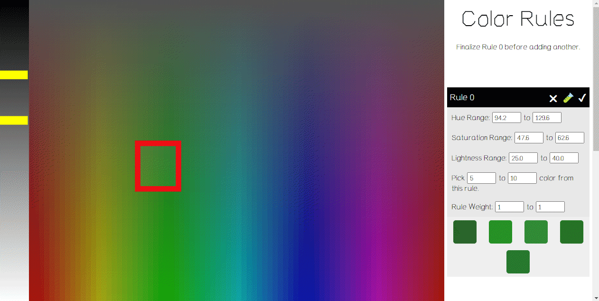

# Color Hoarding with Licia He

If Licia can only have one passion project, it would be hoarding colorful art supplies.

This is Licia's repository for sharing her color collections and experiments.

## About
[Licia He](https://www.eyesofpanda.com/) is a generative artist who loves collecting art supplies. Licia has been focused on bridging her digital and physical painting practices through digital and physical innovations.

## [Color Rules Generator](tutorial/Color_Rules_Generator.md)

[Color Rule Generator](https://www.eyesofpanda.com/project/color_rules_generator/) is a color scheme-creating tool designed for generative artists. In contrast to tools that assist in curating sets of colors, this tool helps users to create color-generating rules.




[**Read more about this tool | Turorial**](tutorial/Color_Rules_Generator.md)

[**Link to the tool**](https://www.eyesofpanda.com/project/color_rules_generator/)

[**Link to the source code folder**](/web/color_generator.html)


## Color Swatcher 
```
Coming in 2023
```


## License and Note

This is a one-woman project growing purely out of passion. It's not affiliated with any of brand/company/manufacturer included in the collection. The color might look significantly different if they were swatched or processed in other ways.

I decided to open source this project, including all the data (spreadsheet + color swatches), the code I used to process the data (in Python), and the web-based system (in Javascript).

If you would like to support me or this project, please consider supporting organizations/movements that help women and non-binary artists & technologists. I recommend donating to organizations like [AnitaB Institute](https://anitab.org/) and [Girls Who Code](https://girlswhocode.com/).

I hope you enjoy it.

Licia He 2022

### License
MIT License

Copyright (c) [2022] [Shiqing He]

Permission is hereby granted, free of charge, to any person obtaining a copy of this software and associated documentation files (the "Software"), to deal in the Software without restriction, including without limitation the rights to use, copy, modify, merge, publish, distribute, sublicense, and/or sell copies of the Software, and to permit persons to whom the Software is furnished to do so, subject to the following conditions:

The above copyright notice and this permission notice shall be included in all copies or substantial portions of the Software.

THE SOFTWARE IS PROVIDED "AS IS", WITHOUT WARRANTY OF ANY KIND, EXPRESS OR IMPLIED, INCLUDING BUT NOT LIMITED TO THE WARRANTIES OF MERCHANTABILITY,FITNESS FOR A PARTICULAR PURPOSE AND NONINFRINGEMENT. IN NO EVENT SHALL THE AUTHORS OR COPYRIGHT HOLDERS BE LIABLE FOR ANY CLAIM, DAMAGES OR OTHER LIABILITY, WHETHER IN AN ACTION OF CONTRACT, TORT OR OTHERWISE, ARISING FROM, OUT OF OR IN CONNECTION WITH THE SOFTWARE OR THE USE OR OTHER DEALINGS IN THE SOFTWARE.