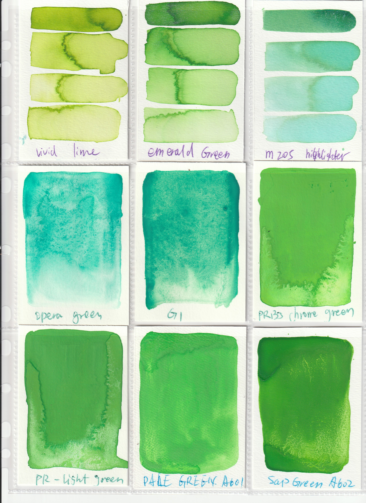
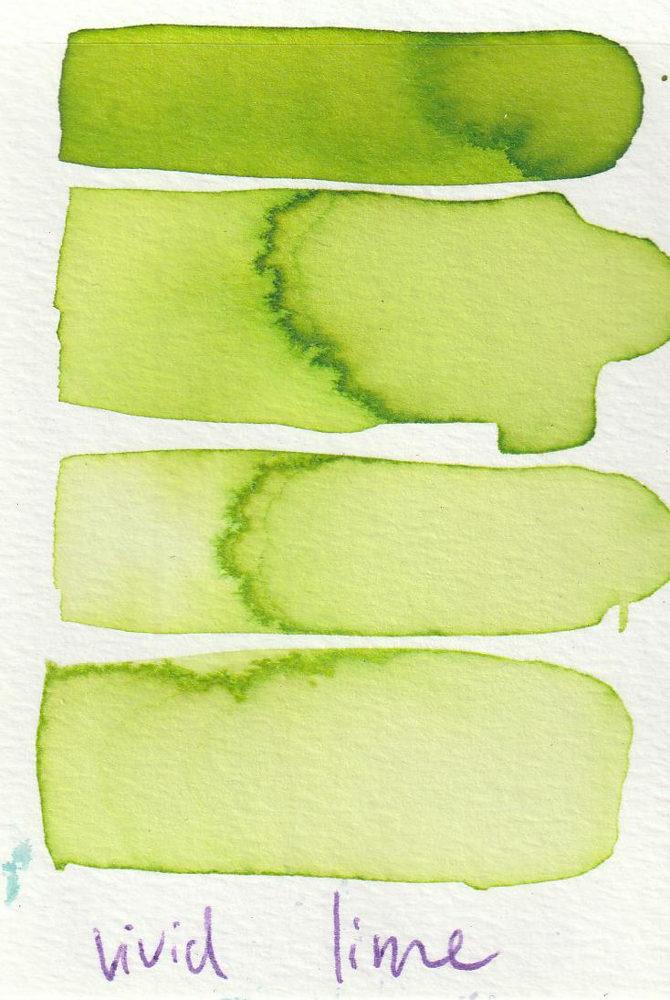

# Color Hoarding with Licia He 

If Licia can only have one passion project, it would be hoarding colorful art supplies.

## Overview
[Licia He](https://www.eyesofpanda.com/) is a generative artist who loves collecting art supplies. Licia has been focused on bridging her digital and physical painting practices through digital and physical innovations.  

She started working on plotter-based generative watercolor paintings in 2019. This digital-physical art practice continues to give her many opportunities (and excuses) to expand her art supply collection. As her art supply collection (especially ink and watercolor) growing significantly, she found it increasingly difficult to organize and pick colors. She naturally gravitates towards her favorites and left many beautiful bottles of ink untouched. 

"That's not ideal!" Licia is determined to try out all wonderful combinations of color. Therefore, she decided to build a color management system for her growing color collection. **Color Hoarding with Licia He** is this management system. 

## About the System 
The system has a couple of goals:
1. Display color swatches of physical colors (ink, watercolor, and etc.) in Licia's collection. 
2. Organize color based on their properties. e.g., brand, type, hue. 
3. Rule-based color palette generation.
4. Manual color palette selection. 

Maybe more features in the future. 

### System Options 
1. Display the primary color extracted. It's sorted by **hue** by default. Alternatively, you can sort by **value** or **saturation**. 
2. You can group colors into different columns by **Brand** and **Type** dropdown.
3. Hover over the color to display the supply information (only available on non-mobile devices).
4. Click on any color to display the scan.
5. Double click to add a color into your selection.

## Data Collection 
At this moment, there are 300+ color in the collection. Each color went through the following process.
1. Licia purchased it or made it. 
2. Licia swatched them on 2.5 x 3.75 inch cards.
3. Licia scanned them in groups of 9, using trading card sleeves. 

4. Licia entered the brand, type, and name information in [a (long) spreadsheet](../raw_data/color_hoarder_data.csv).
5. Licia wrote a [Python script for image segmentation](../image_processing/step0_image_segmentation.py). It cut the raw scans into individual cards. It generates two folders of processed color swatch.
   1. The first cut keeps the boundary and the handwritten color name. e.g.,
    
   2. The second cut removes the text and the boundary, and rename the swatch using information from the spreadsheet. e.g., 
    

6. Licia wrote another [Python script](../image_processing/step1_color_extraction.py) that extract and filter color (rgb values) from these color swatch. At most top 10 non-background rgb values from each art supply are kept in the collection. It generates a [json file](../processed/analysis/full_data.json) that stores all data entries. 
   
## License and Note 

This is a one-women project growing purely out of passion. It's not affiliated with any of brand/company/manufacturer included in the collection. The color might look significantly different if they were swatched or processed in other ways. 

I decide to open source this project, including all the data (spreadsheet + color swatches), the code I used to process the data (in Python), and the web-based management system (in Javascript). 

I hope you enjoy it. 

Licia He 2022

### License 
MIT License

Copyright (c) [2022] [Shiqing He]

Permission is hereby granted, free of charge, to any person obtaining a copy
of this software and associated documentation files (the "Software"), to deal
in the Software without restriction, including without limitation the rights
to use, copy, modify, merge, publish, distribute, sublicense, and/or sell
copies of the Software, and to permit persons to whom the Software is
furnished to do so, subject to the following conditions:

The above copyright notice and this permission notice shall be included in all
copies or substantial portions of the Software.

THE SOFTWARE IS PROVIDED "AS IS", WITHOUT WARRANTY OF ANY KIND, EXPRESS OR
IMPLIED, INCLUDING BUT NOT LIMITED TO THE WARRANTIES OF MERCHANTABILITY,
FITNESS FOR A PARTICULAR PURPOSE AND NONINFRINGEMENT. IN NO EVENT SHALL THE
AUTHORS OR COPYRIGHT HOLDERS BE LIABLE FOR ANY CLAIM, DAMAGES OR OTHER
LIABILITY, WHETHER IN AN ACTION OF CONTRACT, TORT OR OTHERWISE, ARISING FROM,
OUT OF OR IN CONNECTION WITH THE SOFTWARE OR THE USE OR OTHER DEALINGS IN THE
SOFTWARE.