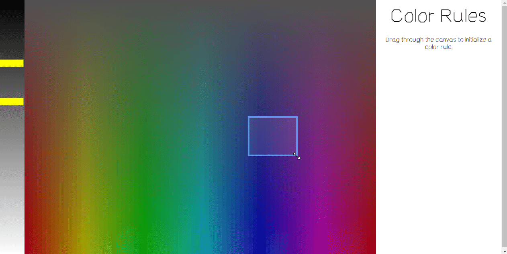
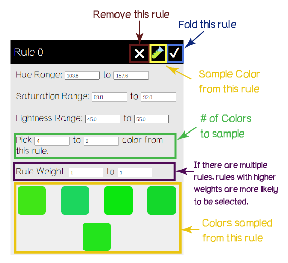
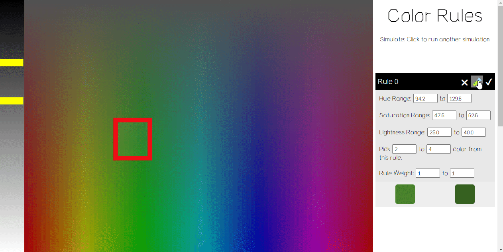
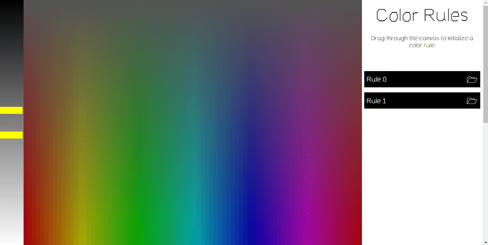
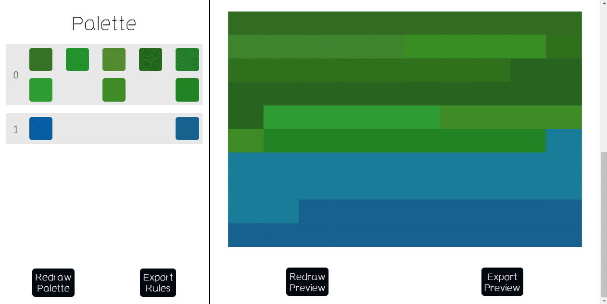
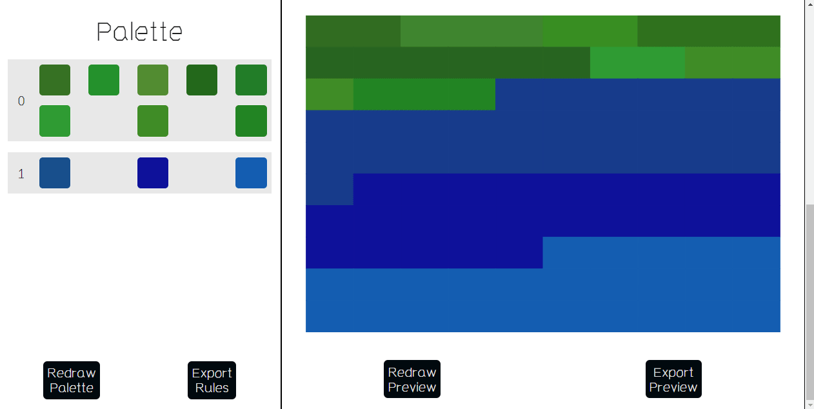

# Color Rule Generator 

[Color Rule Generator](https://www.eyesofpanda.com/project/color_rule_generator/) is a color scheme-creating tool designed for generative artists. In contrast to tools that assist in curating sets of colors, this tool helps users create color-generating rules.

[Go to the Live System](https://www.eyesofpanda.com/project/color_rule_generator/)

## Getting Started 

The Color Rule Generator helps users to create a set of **color generating rules.**  Each rule is essentially a section of the 3-dimensional space formed by Hue, Saturation, and Lightness (known as [HSL](https://en.wikipedia.org/wiki/HSL_and_HSV)). Users create rules by setting a **selection range** for each of these dimensions. 

### Step 0: Adjust Lightness 

The leftmost panel indicates the lightness level. The lightest value (0%) is on the bottom, and the darkest value (100%) is on the top. Drag yellow bars to adjust the lightness range for the current rule.  The *mean* lightness value within this range is visualized on the hue-saturation screen (the rainbow area). 

e.g., the lower bar has the value of 75, the upper bar has the value of 25, then the hue-saturation screen displays a lightness value of 50. 

### Step 1: Define Hue and Saturation Range 

Define the Hue and Saturation range by dragging a rectangle on the main (rainbow) display. A rule information panel will appear on the right. You can enter adjust the rectangle by entering values on the panel, or modify the rectangle directly. 


### Step 2: Simulate Color Sampling from One Rule. 

<figcaption align = "center"><b>Details of the Information Panel</b></figcaption>

The information panel displays the specific content of each rule. Specifically, each rule contains 
1. Hue Range (values between 0 and 360 (degrees)):  determined by the space between the two yellow bars in step 0. 
2. Saturation Range (between 0 and 100 (%)):  determined by the rectangle's location and *height* generated in step 1. 
3. Lightness Range (between 0 and 100 (%)): determined by the rectangle's location and *width* generated in step 1. 
4. Number of colors: Within the 3-dimensional space defined by Hue, Saturation, and Lightness, determine how many colors this rule can generate. e.g., if the # of pick ranges is 0 to 0, this rule does not produce any color. 
5. Rule Weight:  If multiple rules exist, you can associate a weight with each rule. Rules with higher weights are more likely to be selected. 

The information panel also provides a quick sample preview on the bottom of each rule.  


Click on the "Testing" icon to resample. 

### Step 3: Add Multiple Rules.

You can create as many rules as you want, **as long as you do not have an unfinalized/pending rule.** Finalize a rule by clicking the "Check" icon. Once the check sign is clicked, the rule information is folded, and you can start adding another rule by going through steps 0 and 1 (adjust yellow bars and create rectangles). If you want to edit a previous rule, click on the "Unfold" icon. 


### Step 4: Generate Simulation 

The system draws a specific number of colors from each rule. All of these colors form a **Palette**. Scroll to the second page to view the palette. On the right of the palette, a preview image is drawn using the following logic: 

1. Create a 10 by 10 grid. 
2. For each rectangle in the grid, randomly\** select a rule. 
3. Within the selected rule, randomly select a color from this rule's current sample. 
4. Sort the order of the rectangles by the index of the rule. 

\** By default, the random function used here creates uniform randomness using Math.random() function. Users can test alternative random functions by replacing the random() function. (More about this in Step 7). 

When selecting rules, the weights associated with rules are considered. Rules with higher weights are more likely to be chosen. 




- The "Redraw Palette" button will recreate the palette by resampling colors from each of the rules in the system. 

- The "Redraw Preview" button will resign the colors of rectangles in the preview image. The palette will not update. 

## Step 5: Adjust Color Weight 




If users have two rules whose weights are both 1, then the preview image is likely to have a 50-50 area ratio between rule 1 and rule 2. If rule 2 is associated with a weight of 3, then the preview image is likely to have a 25:75 area ratio. 

The weight is defined as a range. e.g., color rule 1 has a weight between 1 and 5. The final weight used for drawing the preview image is a random number between 1 and 5. 

## Step 6: Export 



There are two export buttons: 
1. Export Rules: it displays the rule set used in the system as a javascript variable: 
```
let rules={
 "rules": {
 "rule_simulates": {
};

```

Each rule contains all the range values.
```
  "0": {"hue": [103.6,174.2],"saturation": [69.8,88.1],"lightness": [45,55],"pick": [4,9],"weight": [1,1]}},
```

The color sample (simulations) associated with each rule is included in the `rule_simulates` field. e.g.
```
"0": ["#23e2c5","#1bd563","#22c766","#35dc86","#27e0ce"]} //Rule 0 is currently associated with these 5 colors
```

2. Export Preview: Download the current preview image as an svg file. 

## Step 7: Helper Functions 

The system provides a list of [Helper Functions](web/js/combo/color_rule_helper_functions.js) that you can use to plug into your own generative systems. Specifically, you can use the `draw_colors_from_rules` function to draw colors using rules and simulations created with this system. 

All the dependencies of this function (e.g., random function, choose, choose with weight function) are included in the same [Helper Functions](web/js/combo/color_rule_helper_functions.js) file.  

You can replace the random() function with your own if you wish to test other distributions or use a seeded random function. 

Use these functions at your own risk; I cannot guarantee the bug-freeness of these functions. 

e.g., you have exported the following rules 
```
let rules={
 "rules": {
  "0": {"hue": [249.4,298.9],"saturation": [26.1,50.5],"lightness": [45,55],"pick": [2,4],"weight": [1,1]},
  "1": {"hue": [209.6,254.6],"saturation": [78.5,94.5],"lightness": [69,76],"pick": [2,4],"weight": [2,5]}},
 "rule_simulates": {
  "0": ["#664bae","#7850be","#693faa"],
  "1": ["#898ef2","#927cfa"]}
};
```

running the following code will generate `x` colors from these rules
```
let x=3;
let results=draw_colors_from_rules(rules["rules"],rules["rule_simulates"],x);
```
results is a list of list. `console.log(results)` will display information similar to this:

```
1.  0: (3)['0', 2, '#693faa'] //each list within the results list is a color selection. 
2.  1: (3) ['1', 0, '#898ef2'] //the first value indicates the rule. e.g., this selection is associated with rule "1". 
3.  2: (3) ['1', 1, '#927cfa']//The second value indicates the index of the color sample chosen from the rule. The third value is the selected color sample in hex format. 
```


## Note | Future Todo:

- There are several known UI issues waiting to be fixed. 
	- The lightness bars and the preview image are not automatically updated in some cases. 
	- If the range (hue/saturation/lightness) is too small, (e.g., 10 to 10), the red rectangle or yellow bar might disappear. 
- Might add additional export format. 
- If you have suggestions, found a bug, or have other comments, feel free to comment on this repository, or reach out to me on SNS (Twitter: [licia_he](https://twitter.com/Licia_He))
- Read more about the license information and other project info on the [main repository page](../README.md)


## Additional Read 
- [COLOR ARRANGEMENT IN GENERATIVE ART](https://tylerxhobbs.com/essays/2021/color-arrangement-in-generative-art) by Tyler Hobbs
- [Fontana](https://pattern.co/nft/fontana/) by Harvey Rayner 
- Color by Betty Edwards: A Course in Mastering the Art of Mixing Colors (Book by Betty Edwards)